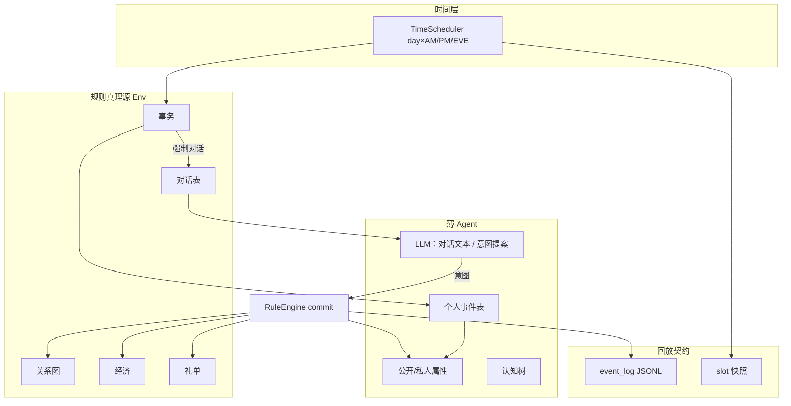

# AI-town 多智能体社会仿真 — 需求与架构计划

本文档汇总项目目标、用户需求规格，以及基于 AgentSociety2 / 参考资料的架构判断与落地建议。  
相关细化文档见：`simulation-development-plan.md`、`yan-yunxiang-gift-flow-reproduction.md`、`sociology-extension-schema-rules-hooks.md`、`papers-reading-notes.md`。

---

## 1. 项目目标

使用 Multi-agent 模拟人类社区/社会，重点实现：

- 模拟人类关系、圈层的交往模式；
- 通过礼物流动机制的拟真，刻画 agent 行为与人类行为的相似程度。

**核心抽象是「关系」**，用以下个人数据刻画关系：

- 信任 / 权威 / 礼物系统 / 好感 / 合作倾向 / 公共记忆 / 工作。

基于关系产生不同互动模式；长期互动形成某种秩序，进而出现家庭、市场、社区、国家等制度领域——这一特征称为 **「制度涌现」**，为拟真的远期目标。

**六大系统**：事务、对话、关系、个人属性、经济、礼物。

---

## 2. 需求规格

### 2.1 工程约束

1. **前后端完全分离**：不沿用参考项目（原 AI-town）的游戏引擎一体架构；前端根据后端日志/快照生成画面。
2. **时间粒度**：按时间顺序推进；粒度为「天 × 上午 / 下午 / 晚上」；单次实验约两个月（约 60 天 × 3 = 180 个 timeSlot）。
3. **推进方式**：时间推进时激活事务调度器，串行化分配并处理事务；全部事务处理完并更新状态后进入下一时刻。
4. **决策与对话**：涉及 Agent 决策与 LLM 对话；后续可引入强化学习相关内容（知识库、决策函数/对话 prompt、结果量化与优化机制）。

### 2.2 个人属性系统

由 **公开个人属性** 与 **私人个人属性** 构成。

**公开属性**（对话双方均可见）：

| 字段                      | 说明       |
| ----------------------- | -------- |
| ID、姓名、教育、年龄、性别、职业、住址、生日 | 基础身份     |
| 爱好、习惯、日常                | 生活画像     |
| 亲属关系、社会标签               | 结构与标签    |
| 信誉（面子）                  | 可观察的社会评价 |

**私人属性**（仅发起对话者 / holder 可见）：

| 模块               | 结构                                                                          |
| ---------------- | --------------------------------------------------------------------------- |
| 大五人格             | O / C / E / A / N                                                           |
| SVO              | 角度与长度                                                                       |
| BDI              | **B** Belief：字典，值为置信度；**D** Desire：字典，值为优先级；**I** Intention：字典，值为时间/计划 slot |
| Emotion（Emothon） | mood → 社交意愿与风险偏好；arousal → 情绪化程度；stress → 合作/竞争倾向；energy → 行动与目标数量          |

### 2.3 事务系统

由 **事务调度器** 与 **个人事件表（PET）** 组成。

- 每个事务对相关人公开，并通过对话传播。
- **公共事务**：道路养护、健康卫生、文化活动、防灾安全、冲突调节、规则制定等。
- **私人事务**：上班下班、生育抚养、红白喜事、购房装修等。
- 事件为相关人员添加目标（如「为救灾汇款 5000 元」）。

**事件（EventInstance）字段**：EID、类型、公开性、发起者、涉及人员及目标、位置、时间、内容摘要、状态。

**个人事件表字段**：EID、知情时间、来源、途径、置信度。

**影响人的路径**：事务强制开启对话 → 写入个人事件表 → 更改个人 Belief；每次对话若涉及事件信息，则更新个人事件表，再据 PET 更新 Belief。

### 2.4 关系系统

**双向有向图**维护关系网络。每条边（A→B 与 B→A 独立，可非对称）包含：

| 字段               | 说明                  |
| ---------------- | ------------------- |
| from, to         | 有向端点                |
| 社会关系基础           | 如亲属 / 同事 / 邻里 / 朋友等 |
| 亲密度、信任度、好感度、权威感  | 可量化关系刻度             |
| 对话记录、上次关系变化、互动摘要 | 可追溯痕迹               |

通过该网络可速查一个人的社交圈。

### 2.5 对话系统

- 由 **单个 LLM** 支持不同模式与上下文。
- 每次对话用 **拼接上下文**：己方全部个人属性 + 对方公开属性 + 关系边（己→对方）相关信息 + 对话上下文。
- **模式**：对话模式、主持人模式、随机发言模式。

**数据结构：**

1. **总对话表**：记录 LLM 生成的自然文本——CID、类型、参与者、模式、时间、内容与摘要、BDIE 具体影响 / 影响力分数。
2. **个体对话认知树**（四层）：
   - 社会层（如「社区对安全很担忧」）
   - 圈子层（如「同事圈子年轻有活力」）
   - 关系层（如「张三值得信赖」）
   - 对话层（聚焦单次对话）

**上呈机制**：某分支的 BDIE 影响力总和超过阈值时合并并上呈——合并节点与上一层内容，生成新摘要，更新个人状态，过程与 LLM 内容写入日志。对话中或结束后修改 BDIE 与关系边状态。

### 2.6 经济系统

个人经济信息记录与更新：

- 现金、存款、负债、借贷上限、收入、必要支出占收入比例、存款比例（意识）。

**月初结算：**

```
cash += income * (1 - essentialExpenseRatio)
repayment = min(debt, cash)
debt -= repayment; cash -= repayment
deposit += cash * savingsRatio
cash -= cash * savingsRatio
```

### 2.7 礼物系统

经济子系统；维护礼单：

| 字段            | 说明                       |
| ------------- | ------------------------ |
| GID, from, to | 标识与方向                    |
| 表达性分数、工具性分数   | 表达性 vs 工具性               |
| 价值、折算价值       | 折算价值 = 价值 × (1 − 表达性分数%) |
| 内容描述、回礼期待窗口时间 | 叙事与时限                    |

- 赠送礼物是事件，由事务系统调度。
- 送礼增加双方关系；收礼后在 I 中添加回礼行动方案。
- 若不在回礼窗口内回礼，或回礼数额小于折算价值 → 降低关系；否则增加关系。

---

## 3. 架构判断与设计原则

### 3.1 相对参考项目与 AgentSociety2

| 判断                        | 说明                                                                              |
| ------------------------- | ------------------------------------------------------------------------------- |
| 不做游戏一体架构                  | 不沿用原 AI-town 的 Convex 引擎、地图寻路、PixiJS 强耦合渲染                                      |
| AS2 作运行时外壳                | 复用 CLI/`AgentSociety` 步进、自定义 `EnvBase`、Replay JSONL、`/api/v1/replay`            |
| 不宜直接用完整 PersonAgent ReAct | 否则世界状态易被 LLM 随意改写，礼物/互惠无法对照实验                                                   |
| 旧 Hook 文档                 | `sociology-extension-schema-rules-hooks.md` 只保留 schema/规则思想，不按 Convex hook 落点实现 |
| 规格主文档                     | 数据结构与管线细节对齐 `simulation-development-plan.md`                                    |

**推荐拓扑**：共享状态放在 **Env 工作区（真理源）**；Agent 侧存公开/私人属性副本与认知树；前端 **只读** replay 日志与快照。

### 3.2 核心原则

1. **LLM 只产出文本与评分/意图提案，不直接写状态**；状态变更 100% 经 RuleEngine 校验。
2. **所有状态变更写入 append-only 日志**；前端只读日志与快照。
3. **关系图 + 个人事件表（PET）→ Belief 是枢纽**；对话是关系更新的触发器，礼单是经济子系统的事件流。
4. **时间粒度**：天 × AM/PM/EVE；约 180 个 timeSlot。

### 3.3 LLM / 规则 / RL 边界

| 职责                     | 谁做                  |
| ---------------------- | ------------------- |
| 对话措辞、场合话术              | LLM                 |
| 送礼对象/金额提案、BDIE 影响提案    | LLM（须经规则裁剪）         |
| 现金、信任、礼债、违约、事务触发与冲突    | **RuleEngine only** |
| StyleProfile、月初结算、回礼窗口 | 公式                  |

**短期不必上强化学习。** 论文共识（Port of Mars、「Should LLM Agents Decide」等）支持：规则层裁决、LLM 仅做意图与叙事。

若后续引入「可学习决策」，建议分三层而非端到端训对话：

1. **知识库**：规范/仪式/职业词条注入 prompt；
2. **可学习决策头**：在离散动作 `{attend, gift, reply, donate, chat, idle}` 上做 bandit / 简单 RL；state = 关系 + 经济 + debt + emotion 向量；
3. **奖励**：互惠率、违约率、面子、圈层稳定度等宏观可测指标；禁止用 LLM-as-judge 作为唯一 reward。

MVP 可用启发式选行动，预留同一接口日后换 RL。

### 3.4 制度涌现的可测路径

不宜一开始就把家庭/市场/社区/国家建模为硬编码实体。建议：

| 阶段  | 内容                  | 可观察物                 |
| --- | ------------------- | -------------------- |
| A   | 关系边 + 互惠规则          | 聚类、互惠率、声望分化（阎云翔 A 档） |
| B   | 公共事务 + PET 广播       | 稳定协调群体、弱「社区」         |
| C   | 权威边 + 纵向礼           | 非对称礼物流、弱「权威秩序」       |
| D   | Ostrom 公共池 / 制裁（后期） | 治理合法性、违规率            |

**制度涌现指标示例**：稳定 clique 数、规则更迭频率、权威集中度、纵向礼占比、违约后合作恢复曲线。

---

## 4. 系统架构与数据枢纽



### 4.1 个人属性

- 公开属性进入对话 prompt；亲属 `kinship[]` 与关系边 `socialBasis=kin` 对齐，避免两套真相。
- 私人 BDI：**B ← PET 同步**；**D ← 事务 Goal 实例化**；**I ← 高优先级/到期目标 + 回礼窗口**；Emotion 只进 StyleProfile，不直接改信任分。

### 4.2 事务

- 「涉及人员及目标」采用 **RoleSlot + GoalTemplate + Resolver**，由生成器填槽，避免写死自然语言名单。
- 三种入口：manual / scheduled / agent_driven（I → 模板实例）。
- 同 slot 冲突：仅 `occupancy=required` 互斥。
- 传播写 PET，再 `syncBelief`；LLM 不直接改 Belief。

### 4.3 对话

- 总对话表 = 客观世界记录；认知树 = 主观分层记忆。
- Prompt 固定拼接：`Self(公私) + Other(公开) + Edge(self→other) + PET(置信>θ) + 认知树摘要 + 历史 + StyleProfile + OutputSchema`。
- 单 LLM 多模式：换 system + mode 约束，不拆三套模型。
- BDIE 影响：LLM 提案必须 clamp。
- MVP：认知树可仅做 dialogue → relation；circle/social 可后置。

### 4.4 关系

建议在需求边字段外补充（服务阎云翔纵向/横向互惠）：

- `giftDebt` / `reciprocityScore`
- `relationAxis: horizontal | vertical_up | vertical_down`

变更只走公式 + reason 日志（对话情感分、送礼、违约三条通道）。

### 4.5 经济与礼物

- 经济：需求中的月初公式即可。
- 礼物闭环：意向 → gift 事务 → 强制短对话 → RuleEngine 扣现金 / 写礼单 / 涨关系 / 写回礼 I → 每 slot 检查窗口。
- 仪式场合可另加 `minGiftNorm`（阎云翔 A 档）。

---

## 5. 时间管线（单 timeSlot）

1. `timeslot.start` 打 log  
2. 若月初：`economy.monthly`  
3. `EventGenerator`：scheduled +（可选）agent_driven + manual  
4. `EventScheduler.processAll`：PET 传播 → Belief → 对话 → 关系/BDIE/认知树 → gift 结算  
5. `giftWindowCheck`  
6. 写 snapshot + `timeslot.end`  

AS2 接法：每个 `society.step` ≈ 1 slot（或 tick 映射墙钟），slot 语义写在自定义 Env 的 `step()`。

---

## 6. 前后端分离：日志即契约

| 层               | 内容                                | 前端用途      |
| --------------- | --------------------------------- | --------- |
| JSONL event_log | 逐条因果事件                            | 时间线、trace |
| slot 快照         | agents / edges / gifts / PET / 队列 | seek、关系图  |
| replay_index    | seq ↔ time ↔ snapshot             | 跳转        |

**强制日志类型（示例）**：`event.*`、`dialogue.*`、`relationship.delta`、`gift.*`、`economy.monthly`、`cognitive.promoted`、`bdi.updated`；每条带 `before/after/reason`（规则拒绝也记）。

---

## 7. 推荐落地顺序

| 顺序  | 内容                                           |
| --- | -------------------------------------------- |
| 1   | 时钟 + LogWriter + Snapshot + Replay API（契约先立） |
| 2   | 属性 + 关系图 + 公式 updater                        |
| 3   | 事务模板 + PET + Belief 同步（先 manual/scheduled）   |
| 4   | 对话控制器 + Prompt 拼接（先双人 dialogue）              |
| 5   | 经济 + 礼单闭环（主验收：送礼→回礼/违约→关系可回放）                |
| 6   | 认知树上呈、agent_driven、公共事务、制度指标                 |

**MVP 暂缓**：完整 Ostrom、国家级制度、端到端 RL、厚渲染前端；前端以时间线 + 关系图 + agent inspector 即可。

MVP 规模建议：10–20 agent、公共/私人模板各约 3 个、先关掉 agent_driven。

更细的 Phase 0–5 与目录结构见 `simulation-development-plan.md`；礼物现象 A 档复现见 `yan-yunxiang-gift-flow-reproduction.md`。

---

## 8. 关键设计决策备忘

| 问题          | 建议                                                         |
| ----------- | ---------------------------------------------------------- |
| 事务「涉及人员及目标」 | RoleSlot + GoalTemplate + Resolver                         |
| Agent 发起事务  | I 中 actionType + params → template → generateFromIntention |
| 冲突事务        | 仅 occupancy=required 互斥                                    |
| 对话风格可控      | StyleProfile 由属性公式推导，LLM 只负责措辞                             |
| 关系更新        | 严格公式 + 日志 reason                                           |
| 回放          | snapshot@slotEnd + event log 增量重放                          |
| 存储          | 配置 JSON；运行时 SQLite/Env 状态；日志 JSONL                         |
| 真相源         | Env 工作区；前端不读 agent 工作区                                     |
| 制度涌现        | 事后用网络/互惠/权威指标度量，不预置制度对象                                    |

---

## 9. 一句话总结

六系统按 **「事务触发 → 对话叙事 → 规则改关系/经济/礼物 → 日志回放」** 串联；关系图与 PET 是状态枢纽；LLM 不写世界；制度涌现用关系/互惠/权威等指标事后度量。AgentSociety2 提供编排与 replay 外壳，社会语义与规则机自建于自定义 Env + 薄 Agent 之上。

---

## 10. 相关文档

| 文档                                                                                       | 关系                     |
| ---------------------------------------------------------------------------------------- | ---------------------- |
| [simulation-development-plan.md](./simulation-development-plan.md)                       | 详细实现规格、Schema、Phase 计划 |
| [yan-yunxiang-gift-flow-reproduction.md](./yan-yunxiang-gift-flow-reproduction.md)       | 阎云翔礼物流动现象与 A 档复现       |
| [sociology-extension-schema-rules-hooks.md](./sociology-extension-schema-rules-hooks.md) | 早期 Hook 式设计（思想保留，实现不跟） |
| [papers-reading-notes.md](./papers-reading-notes.md)                                     | 论文价值排序与机制启发            |
| [README.md](./README.md)                                                                 | Reference 目录索引         |
