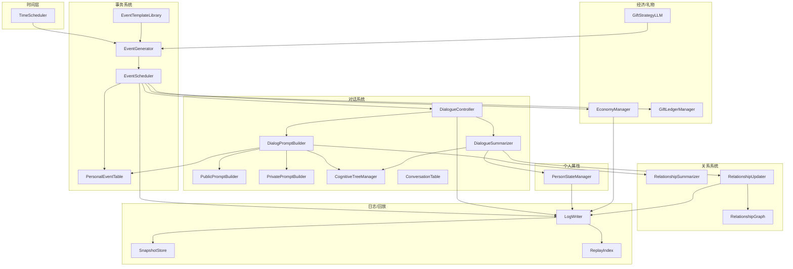
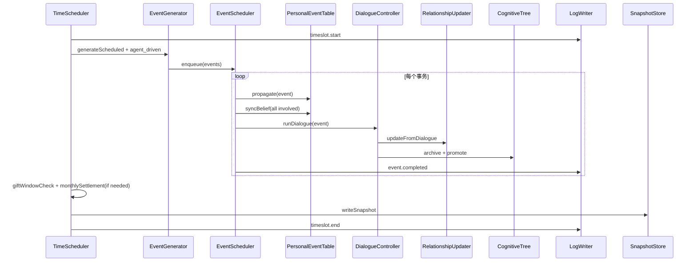

# 多智能体社会仿真 — 详细开发计划

本文档为 AI-town 社会学扩展项目的**详细设计规格与分阶段开发计划**，涵盖数据结构、功能组件、流程管线及 Demo 级回放日志系统。

**项目目标**：使用 Multi-agent 模拟人类关系、圈层的交往模式，通过礼物流动机制的拟真，刻画 agent 行为与人类行为的相似程度。核心抽象为「关系」，以信任 / 权威 / 礼物系统 / 好感 / 合作倾向 / 公共记忆 / 工作 等个人数据刻画关系，并观察家庭、市场、社区、国家等制度领域的涌现。

**与参考项目 AI-town 的关系**：借鉴其 LLM 对话拼接、异步认知层与 input 队列思想；**不**沿用 Convex 游戏引擎、地图寻路与 PixiJS 渲染。本项目采用**前后端完全分离**，前端根据后端日志生成画面。

---

## 0. 总体架构

### 0.1 六大系统

| 系统 | 职责 |
| --- | --- |
| 事务 | 范例库、生成器、调度器、个体事件表 |
| 对话 | 总对话表、认知树、Prompt 生成、摘要、微调控制 |
| 个人属性 | 公开/私人属性、Prompt 生成器、动态维护 |
| 关系 | 双向有向图、摘要生成、可量化更新器 |
| 经济 | 个人经济信息及月初结算 |
| 礼物 | 礼单追踪（经济子系统），送礼为事务 |

### 0.2 组件图



### 0.3 核心设计原则

1. **LLM 只产出文本与评分，不直接写状态**（状态变更 100% 经 RuleEngine 校验）
2. **所有状态变更写入 append-only 日志**，前端只读日志与快照
3. **关系图是六大系统的枢纽**
4. **时间粒度**：天 × 上午/下午/晚上；单次实验约 60 天（180 个 timeSlot）

### 0.4 存储策略（MVP）

| 数据 | 存储方式 | 理由 |
| --- | --- | --- |
| 静态配置（范例库、Agent 初始态） | JSON 文件 | 可读、可版本管理 |
| 运行时状态 | SQLite | 支持查询、事务、索引 |
| 对话全文、日志 | append-only JSONL + SQLite 索引 | 回放友好 |
| 快照 | 每 timeSlot 一个 JSON 或 SQLite blob | 任意时刻 seek |

### 0.5 推荐目录结构

```
sim/
├── backend/
│   ├── engine/
│   │   ├── scheduler.ts
│   │   ├── event_scheduler.ts
│   │   └── experiment.ts
│   ├── systems/
│   │   ├── person/
│   │   ├── relationship/
│   │   ├── event/
│   │   ├── dialogue/
│   │   ├── economy/
│   │   └── gift/
│   ├── cognition/
│   │   ├── bdi.ts
│   │   ├── cognitive_tree.ts
│   │   └── emothon.ts
│   ├── llm/
│   ├── rules/
│   ├── log/
│   ├── store/
│   └── api/
├── frontend/
│   ├── replay/
│   ├── views/
│   └── adapters/
├── shared/types/
└── data/
    ├── event_templates/
    └── agents.json
```

---

## 1. 事务系统

### 1.1 设计原则：角色槽位 + 目标模板

「涉及人员及目标」拆成三层，不写死自然语言：

```
EventTemplate（范例）
  └─ roleSlots[]（角色槽）
  └─ goalTemplates[]（目标模板）
       └─ EventInstance（生成器填充 agentId）
            └─ PersonalGoalAssignment（写入 D/I）
```

### 1.2 事务范例库 Schema

```typescript
interface EventTemplate {
  templateId: string;
  category: "public" | "private";
  subType: string;
  visibility: "public" | "private" | "semi";

  trigger: {
    method: "manual" | "scheduled" | "agent_driven";
    schedule?: { cron?: string; probabilityPerSlot?: number; validSlots?: ("AM"|"PM"|"EVE")[] };
    preconditions?: Precondition[];
  };

  roleSlots: RoleSlot[];
  goalTemplates: GoalTemplate[];

  dialogue: {
    mode: "dialogue" | "host" | "random";
    minParticipants: number;
    maxParticipants: number;
    maxTurns: number;
    forced: true;
  };

  locationType: "home" | "workplace" | "community" | "venue" | "abstract";
  durationSlots: number;
  contentSummaryTemplate: string;
}

interface RoleSlot {
  slotId: string;
  label: string;
  cardinality: number | { min: number; max: number };
  required: boolean;
  resolver: RoleResolver;
  occupancy: "required" | "optional";
}

type RoleResolver =
  | { type: "fixed"; agentId: string }
  | { type: "self"; fromAgentId: string }
  | { type: "kinship"; ofSlot: string; relation: string }
  | { type: "relationship"; ofSlot: string; metric: "trust"|"affection"; topK: number }
  | { type: "same_community"; communityId?: string }
  | { type: "same_workplace"; ofSlot: string }
  | { type: "random_adult"; exclude?: string[] }
  | { type: "tag_match"; tag: string; count: number };

interface GoalTemplate {
  goalTemplateId: string;
  assignedToSlot: string;
  goalType: GoalType;
  params: Record<string, number | string | boolean>;
  deadline?: { offsetSlots: number };
  priority: number;
  optional: boolean;
}

type GoalType =
  | "attend"
  | "donate_cash"
  | "reply_gift"
  | "give_gift"
  | "spread_info"
  | "complete_dialogue"
  | "work_shift"
  | "update_belief"
  | "custom";
```

### 1.3 事务实例 Schema

```typescript
interface EventInstance {
  eid: string;
  templateId: string;
  category: "public" | "private";
  subType: string;
  visibility: "public" | "private" | "semi";
  time: { day: number; slot: "AM" | "PM" | "EVE" };
  location: string;
  status: "queued" | "processing" | "completed" | "rejected" | "expired";
  roleBindings: Record<string, string[]>;
  goals: PersonalGoal[];
  summary: string;
  payload: Record<string, unknown>;
  source: "manual" | "scheduled" | "agent_driven";
  sourceAgentId?: string;
}

interface PersonalGoal {
  goalId: string;
  eid: string;
  agentId: string;
  roleSlot: string;
  goalType: GoalType;
  description: string;
  params: Record<string, unknown>;
  deadline?: { day: number; slot: "AM"|"PM"|"EVE" };
  priority: number;
  status: "pending" | "in_progress" | "completed" | "failed" | "waived";
}
```

### 1.4 事务范例（3 条）

#### 公共事务 — 道路养护

```json
{
  "templateId": "public.road_maintenance",
  "category": "public",
  "subType": "road_maintenance",
  "visibility": "public",
  "trigger": {
    "method": "scheduled",
    "schedule": { "probabilityPerSlot": 0.02, "validSlots": ["AM"] }
  },
  "roleSlots": [
    {
      "slotId": "initiator",
      "label": "社区负责人",
      "cardinality": 1,
      "required": true,
      "resolver": { "type": "tag_match", "tag": "community_leader", "count": 1 },
      "occupancy": "required"
    },
    {
      "slotId": "affected_residents",
      "label": "受益居民",
      "cardinality": { "min": 3, "max": 8 },
      "required": true,
      "resolver": { "type": "same_community" },
      "occupancy": "optional"
    }
  ],
  "goalTemplates": [
    {
      "goalTemplateId": "donate",
      "assignedToSlot": "affected_residents",
      "goalType": "donate_cash",
      "params": { "amount": 200 },
      "priority": 70,
      "optional": true
    },
    {
      "goalTemplateId": "attend_meeting",
      "assignedToSlot": "affected_residents",
      "goalType": "attend",
      "params": {},
      "priority": 50,
      "optional": false
    }
  ],
  "dialogue": { "mode": "host", "minParticipants": 2, "maxParticipants": 6, "maxTurns": 8, "forced": true },
  "locationType": "community",
  "durationSlots": 1,
  "contentSummaryTemplate": "社区道路养护动员，请相关居民参与讨论并自愿捐款"
}
```

#### 私人事务 — 红白喜事（婚礼）

```json
{
  "templateId": "private.wedding",
  "category": "private",
  "subType": "wedding",
  "visibility": "semi",
  "trigger": {
    "method": "scheduled",
    "schedule": { "probabilityPerSlot": 0.005 },
    "preconditions": [{ "type": "agent_age_range", "min": 22, "max": 35 }]
  },
  "roleSlots": [
    {
      "slotId": "initiator",
      "label": "新人",
      "cardinality": 2,
      "required": true,
      "resolver": { "type": "random_adult" },
      "occupancy": "required"
    },
    {
      "slotId": "kin",
      "label": "亲属",
      "cardinality": { "min": 2, "max": 6 },
      "resolver": { "type": "kinship", "ofSlot": "initiator", "relation": "family" },
      "occupancy": "optional"
    },
    {
      "slotId": "friends",
      "label": "朋友",
      "cardinality": { "min": 3, "max": 10 },
      "resolver": { "type": "relationship", "ofSlot": "initiator", "metric": "affection", "topK": 10 },
      "occupancy": "optional"
    }
  ],
  "goalTemplates": [
    {
      "goalTemplateId": "gift",
      "assignedToSlot": "friends",
      "goalType": "give_gift",
      "params": { "expressiveScore": 0.8, "valueFormula": "income*0.05" },
      "deadline": { "offsetSlots": 3 },
      "priority": 80,
      "optional": false
    },
    {
      "goalTemplateId": "attend",
      "assignedToSlot": "kin",
      "goalType": "attend",
      "params": {},
      "priority": 90,
      "optional": false
    }
  ],
  "dialogue": { "mode": "dialogue", "minParticipants": 2, "maxParticipants": 4, "maxTurns": 6, "forced": true },
  "locationType": "venue",
  "durationSlots": 1,
  "contentSummaryTemplate": "{{initiator.name}}举办婚礼，亲友需出席随礼"
}
```

#### Agent 驱动 — 送礼

```json
{
  "templateId": "private.gift_giving",
  "category": "private",
  "subType": "gift",
  "visibility": "private",
  "trigger": { "method": "agent_driven" },
  "roleSlots": [
    {
      "slotId": "initiator",
      "label": "送礼者",
      "cardinality": 1,
      "resolver": { "type": "self", "fromAgentId": "{{sourceAgentId}}" },
      "occupancy": "required"
    },
    {
      "slotId": "receiver",
      "label": "收礼者",
      "cardinality": 1,
      "resolver": { "type": "relationship", "ofSlot": "initiator", "metric": "trust", "topK": 1 },
      "occupancy": "optional"
    }
  ],
  "goalTemplates": [
    {
      "goalTemplateId": "give",
      "assignedToSlot": "initiator",
      "goalType": "give_gift",
      "params": { "value": "{{intention.params.value}}", "expressiveScore": "{{intention.params.expressiveScore}}" },
      "priority": 85,
      "optional": false
    },
    {
      "goalTemplateId": "reply",
      "assignedToSlot": "receiver",
      "goalType": "reply_gift",
      "params": { "minAdjustedValue": "from_event" },
      "deadline": { "offsetSlots": 6 },
      "priority": 75,
      "optional": false
    }
  ],
  "dialogue": { "mode": "dialogue", "minParticipants": 2, "maxParticipants": 2, "maxTurns": 4, "forced": true },
  "locationType": "abstract",
  "durationSlots": 1,
  "contentSummaryTemplate": "{{initiator.name}}向{{receiver.name}}赠送礼物"
}
```

### 1.5 事务生成器（三种调度）

```typescript
interface EventGenerator {
  generateManual(templateId: string, overrides?: Partial<EventInstance>): EventInstance;
  generateScheduled(t: SimTime, ctx: GeneratorContext): EventInstance[];
  generateFromIntention(agentId: string, intention: IntentionRecord, ctx: GeneratorContext): EventInstance | null;
}
```

| 调度方式 | 触发 | 用途 |
| --- | --- | --- |
| 人工监督 | `generateManual` | 调试、演示、对照实验 |
| 时间随机 | `generateScheduled` | 公共/私人事务按概率生成 |
| Agent 驱动 | `generateFromIntention` | Agent 的 I 行动方案 → 事务实例 |

**动态目标参数来源（公式层，不用 LLM）：**

| goalType | 动态参数 |
| --- | --- |
| `donate_cash` | `min(500, income*0.1)` 或模板固定值 |
| `give_gift` | LLM 提议 value → RuleEngine 裁剪到 `[cash*0.01, cash*0.3]` |
| `reply_gift` | 从 GiftRecord.adjustedValue 读取 |
| `attend` | 无参数 |
| `spread_info` | topK=3 高 trust 邻居 |

### 1.6 事务调度器

- 维护串行化事务队列，按优先级处理
- **冲突检测**：`occupancy=required` 的 agent 同一 timeSlot 只能参与一个 required 事务
- **优先级**：`forced + agent_driven > public > private`；同优先级按 deadline 近者优先

```typescript
class EventScheduler {
  enqueue(event: EventInstance): { accepted: boolean; reason?: string };
  detectConflict(event: EventInstance): string | null;
  async processAll(t: SimTime, pipeline: EventPipeline): Promise<void>;
}
```

### 1.7 个体事件表

```typescript
interface PersonalEventRecord {
  id: string;
  agentId: string;
  eid: string;
  learnedAt: { day: number; slot: "AM"|"PM"|"EVE" };
  source: "direct" | "dialogue" | "public_broadcast" | "kin_network";
  channel: string;
  sourceAgentId?: string;
  confidence: number;
  contentSnapshot: string;
  lastUpdatedAt: SimTime;
}
```

**传播规则：**

- `public`：所有 agent 写入（confidence=1.0）
- `semi`：involved + kin + topK neighbors
- `private`：仅 involved
- 对话提及事件：听者 confidence += 0.1（上限 1.0）
- 每次 PET 变更后 `syncBeliefFromEventTable`

---

## 2. 对话系统

### 2.1 总对话表

```typescript
interface ConversationRecord {
  cid: string;
  type: "dialogue" | "host" | "random";
  mode: "dialogue" | "host" | "random";
  participants: string[];
  relatedEids: string[];
  time: SimTime;
  messages: Array<{
    turn: number;
    speakerId: string;
    text: string;
    timestamp: SimTime;
    meta?: { mentionedEids?: string[]; sentiment?: number; politeness?: number };
  }>;
  summary: string;
  status: "active" | "completed" | "aborted";
  bdieImpact: {
    [agentId: string]: {
      beliefDelta: Record<string, number>;
      desireDelta: Record<string, number>;
      intentionDelta: Record<string, number>;
      emothonDelta: Partial<Emothon>;
      influenceScore: number;
    };
  };
  relationshipDeltas: Array<{
    from: string; to: string;
    before: Partial<RelationshipEdge>; after: Partial<RelationshipEdge>;
    reason: string;
  }>;
}
```

### 2.2 个体对话认知树

四层：**社会层 → 圈子层 → 关系层 → 对话层**

```typescript
interface CognitiveNode {
  nodeId: string;
  agentId: string;
  layer: "social" | "circle" | "relation" | "dialogue";
  scope?: string;
  content: string;
  influenceSum: number;
  sourceRefs: string[];
  parentId?: string;
  childIds: string[];
  createdAt: SimTime;
  updatedAt: SimTime;
  archived: boolean;
}
```

**上呈阈值（初始值）：**

| 层 | 阈值 | 合并方式 |
| --- | --- | --- |
| dialogue → relation | influenceSum ≥ 15 | LLM 摘要 + 旧节点合并 |
| relation → circle | 7 天内同 scope ≥ 40 | 规则聚合 + LLM 润色 |
| circle → social | 同 circle ≥ 100 | LLM 摘要，写入 belief |

### 2.3 Prompt 生成器

```
[System] 身份 + 模式
[Self 私人+公开属性]  ← PrivatePromptBuilder + PublicPromptBuilder
[Other 公开属性]
[关系摘要]            ← RelationshipSummarizer
[相关事件 PET]        ← confidence > θ
[认知树 relation/circle 摘要]
[对话历史]
[StyleProfile 约束]   ← 微调机制
[Output Schema]
```

### 2.4 对话/决策微调机制（StyleProfile）

由属性公式推导，保证可控可追踪：

```typescript
interface StyleProfile {
  talkativeness: number;           // E + mood + energy
  formality: number;                 // age + occupation + 标签
  directness: number;                // N + arousal
  cooperationBias: number;           // A + SVO + stress
  riskTolerance: number;             // mood + N
  emotionalExpressiveness: number;   // arousal + E
}
```

**DialogueController 流程：**

1. `ruleBasedTurnDecision`（是否继续、发言约束）
2. LLM 生成文本
3. `postProcess`（长度、重复度）
4. `extractMeta`（mentionedEids, sentiment）
5. 实时更新 PET
6. 对话结束 → 摘要 → BDIE 评分 → 关系更新 → 认知树归档

### 2.5 知识库（轻量）

```typescript
interface KnowledgeEntry {
  kid: string;
  category: "norm" | "vocabulary" | "ritual" | "occupation";
  key: string;
  content: string;
  tags: string[];
}
```

按 `event.subType + occupation` 检索注入 Prompt（如婚礼随礼规范）。

---

## 3. 个人属性系统

### 3.1 公开属性（对话双方可见）

```typescript
interface PublicProfile {
  id: string;
  name: string;
  education: string;
  age: number;
  gender: string;
  occupation: string;
  address: string;
  birthday: string;
  hobbies: string[];
  habits: string[];
  dailyRoutine: string;
  kinship: KinshipEdge[];
  socialTags: string[];
  reputation: number;  // 信誉/面子
}
```

### 3.2 私人属性（仅 holder 可见）

```typescript
interface PrivateState {
  agentId: string;
  bigFive: { O: number; C: number; E: number; A: number; N: number };
  svo: { angle: number; length: number };
  bdi: {
    belief: Record<string, number>;
    desire: Record<string, number>;
    intention: Record<string, number>;
  };
  emothon: {
    mood: number;
    arousal: number;
    stress: number;
    energy: number;
  };
}
```

- **Belief**：字典，值为置信度；由个体事件表同步
- **Desire**：字典，值为优先级；事务为目标添加
- **Intention**：字典，值为计划 timeSlot；行动方案由事务生成器承接

---

## 4. 关系系统

### 4.1 关系边（双向有向图）

```typescript
interface RelationshipEdge {
  from: string;
  to: string;
  socialBasis: "kin" | "colleague" | "neighbor" | "friend" | "stranger" | "other";
  intimacy: number;           // 0~100
  trust: number;              // 0~100
  affection: number;          // -100~100
  authority: number;          // 0~100
  cooperationTendency: number; // 0~1
  dialogueRefs: string[];
  lastChanged: SimTime;
  interactionSummary: string;
}
```

A→B 与 B→A 为两条独立边（非对称）。

### 4.2 关系更新器（可量化公式）

**对话结束：**

```
trust     += clamp(2*avgSentiment + 0.1*turnBalance + 0.05*influence, -5, 5)
affection += clamp(3*avgSentiment + 0.1*influence, -8, 8)
intimacy  += clamp(1.5*avgSentiment + 0.2*turnBalance, -3, 3)
```

**送礼：**

```
trust     += 2 + 0.001 * adjustedValue
affection += 3 + 0.002 * expressiveScore * value
intimacy  += 1 + 0.001 * expressiveScore * 100
```

**回礼违约：**

```
trust -= 8; affection -= 12; intimacy -= 5
```

每条变更写入日志：`before`, `after`, `reason`, `formula`。

---

## 5. 经济系统

```typescript
interface EconomyState {
  agentId: string;
  cash: number;
  deposit: number;
  debt: number;
  creditLimit: number;
  income: number;
  essentialExpenseRatio: number;
  savingsRatio: number;
  lastSettlementDay: number;
}
```

**月初结算：**

```
cash += income * (1 - essentialExpenseRatio)
repayment = min(debt, cash)
debt -= repayment; cash -= repayment
savings = cash * savingsRatio
deposit += savings; cash -= savings
```

---

## 6. 礼物系统

```typescript
interface GiftRecord {
  gid: string;
  eid: string;
  from: string;
  to: string;
  expressiveScore: number;
  instrumentalScore: number;
  value: number;
  adjustedValue: number;       // value * (1 - expressiveScore)
  description: string;
  givenAt: SimTime;
  replyWindowEnd: SimTime;
  status: "pending_reply" | "replied" | "defaulted" | "closed";
  replyGid?: string;
}
```

**流程：**

1. 送礼 → 创建 gift 事务 → 强制对话 → 扣 cash
2. 收礼者 I 中添加回礼行动方案
3. 窗口内足额回礼 → 关系提升
4. 未回礼或不足 → 关系下降 + `gift.defaulted` 日志

**送礼策略：** GiftStrategyLLM 输出 `{ targetAgentId, value, expressiveScore }` → RuleEngine 校验 `[income*0.01, cash*0.5]`。

---

## 7. 日志与 Demo 回放系统

### 7.1 三层存储

```
Layer 1: event_log.jsonl     — append-only，seq + simTime + type + payload
Layer 2: snapshots/          — 每 timeSlot 结束完整状态快照
Layer 3: replay_index.sqlite — seq ↔ simTime ↔ snapshotPath
```

### 7.2 日志条目格式

```typescript
interface LogEntry {
  seq: number;
  simTime: { day: number; slot: "AM"|"PM"|"EVE" };
  type: LogEventType;
  payload: unknown;
  statePointers?: {
    snapshotId?: string;
    affectedAgents?: string[];
    affectedEids?: string[];
    affectedCids?: string[];
  };
}
```

**主要事件类型：**

- `experiment.start` / `experiment.end`
- `timeslot.start` / `timeslot.end`
- `event.created` / `event.propagated` / `event.completed` / `event.rejected`
- `dialogue.start` / `dialogue.message` / `dialogue.end`
- `relationship.delta`
- `gift.given` / `gift.replied` / `gift.defaulted`
- `economy.monthly`
- `cognitive.promoted`
- `bdi.updated`

### 7.3 快照 Schema

```typescript
interface WorldSnapshot {
  snapshotId: string;
  simTime: SimTime;
  seq: number;
  agents: Record<string, { public: PublicProfile; private: PrivateState; economy: EconomyState }>;
  relationships: RelationshipEdge[];
  personalEventTables: Record<string, PersonalEventRecord[]>;
  cognitiveTrees: Record<string, CognitiveNode[]>;
  giftLedger: GiftRecord[];
  eventQueue: EventInstance[];
  metrics: SlotMetrics;
}
```

### 7.4 ReplayEngine API

```typescript
interface ReplayEngine {
  loadExperiment(runId: string): void;
  seekTo(simTime: SimTime): WorldSnapshot;
  seekToSeq(seq: number): WorldSnapshot;
  play(from: SimTime, to: SimTime, speed: number): AsyncIterable<LogEntry>;
  traceAgent(agentId: string): LogEntry[];
  traceEvent(eid: string): LogEntry[];
  traceRelationship(a: string, b: string): LogEntry[];
  diffSnapshots(before: string, after: string): StateDiff;
}
```

**实现要点：** 每个 `timeSlot.end` 写快照；seek 时加载最近 snapshot + 重放 `(snapshot.seq, targetSeq]` 之间的 log。

---

## 8. 端到端流程管线（单 timeSlot）



---

## 9. LLM 与规则边界

| 职责 | LLM | RuleEngine |
| --- | --- | --- |
| 生成对话文本 | ✅ | ❌ |
| BDIE 影响评分 | ✅ 提议 | ✅ 裁剪 |
| 修改 trust/affection/现金 | ❌ | ✅ |
| 判断礼物是否有效 | ❌ | ✅ |
| 事务是否触发 | ❌ | ✅ |
| 认知树上呈摘要 | ✅ 生成 | ✅ 决定是否上呈 |
| 关系图结构变更 | ❌ | ✅ |

---

## 10. 分阶段开发计划

### Phase 0：基础设施（3 天）

| 任务 | 产出 | 验收 |
| --- | --- | --- |
| 项目骨架 `sim/` | 目录结构、共享 types | 可运行空实验 |
| SQLite + JSONL 存储层 | Store, LogWriter | 写入/读取 log |
| TimeScheduler | day×slot 循环 | 180 步空跑 |
| ReplayEngine v0 | seekToSeq, snapshots | 前端可加载回放 |

### Phase 1：事务闭环（5 天）

| 任务 | 产出 | 验收 |
| --- | --- | --- |
| EventTemplateLibrary | 5 公共 + 5 私人模板 | JSON 可加载 |
| RoleResolver + GoalInstantiator | 人员/目标动态填充 | 3 种 resolver 可用 |
| EventGenerator（3 入口） | manual / scheduled / agent_driven | 生成有效 EventInstance |
| EventScheduler | 队列 + 冲突拒绝 | 同 agent 冲突被拒绝并写 log |
| PersonalEventTable | 传播 + Belief 同步 | 对话提及提升 confidence |

### Phase 2：对话 & 属性（5 天）

| 任务 | 产出 | 验收 |
| --- | --- | --- |
| Public/Private PromptBuilder | 模板化 prompt | 输出稳定格式 |
| DialogueController | 多 mode、turn 控制 | 4~8 轮对话完成 |
| StyleProfile 推导 | 属性→风格参数 | 不同人格对话差异可观察 |
| DialogueSummarizer | 摘要 + keyFacts | 写入 Belief |
| ConversationTable | 持久化 | 可按 cid 查询 |
| 知识库 v0 | norm + ritual 10 条 | 婚礼/送礼 prompt 注入 |

### Phase 3：关系 & 认知树（4 天）

| 任务 | 产出 | 验收 |
| --- | --- | --- |
| RelationshipGraph | 双向有向 JSON/SQLite | 速查社交圈 |
| RelationshipUpdater | 对话/礼物/违约公式 | 每条 delta 有 reason+formula |
| RelationshipSummarizer | 注入 prompt | 对话上下文含关系 |
| CognitiveTreeManager | 四层 + 上呈 | 超阈值节点晋升并写 log |

### Phase 4：经济 & 礼物（4 天）

| 任务 | 产出 | 验收 |
| --- | --- | --- |
| EconomyManager | 月初结算 | 公式正确 |
| GiftLedgerManager | 礼单 CRUD + 窗口检查 | 违约检测 |
| GiftStrategyLLM | 决策 + 规则校验 | 不超额送礼 |
| 礼物事务模板打通 | gift 全流程 | 日志可追踪送礼→回礼/违约 |

### Phase 5：集成实验 & 前端回放（5 天）

| 任务 | 产出 | 验收 |
| --- | --- | --- |
| 10~20 Agent 初始化配置 | agents.json | 含 kinship/workplace |
| 60 天实验脚本 | batch runner | 一键跑完 |
| Replay 前端 | 时间线 + agent Inspector + 关系图 | 任意 slot seek |
| 指标导出 | trust 均值、reciprocity_rate | CSV/JSON |
| 对照实验 | 2 组 config | 可复现 |

**总计：约 26 天**

---

## 11. MVP 裁剪（14 天交付版）

**保留：**

- Phase 0 全部
- Phase 1（模板减至 3+3）
- Phase 2（知识库 5 条 norm）
- Phase 3（关系更新：对话+礼物）
- Phase 4（礼物为核心）
- Phase 5（最小时间线回放）

**暂缓：**

- Agent 驱动事务生成（仅 manual + scheduled）
- 认知树 circle/social 层（仅 dialogue → relation）
- 公共事务大类（留 1 个 road_maintenance）

---

## 12. 关键设计决策备忘

| 问题 | 建议 |
| --- | --- |
| 「涉及人员及目标」 | RoleSlot + GoalTemplate + Resolver，生成器填槽 |
| Agent 发起事务 | I 中 actionType + params → template → generateFromIntention |
| 冲突事务 | 仅 occupancy=required 互斥 |
| 对话风格可控 | StyleProfile 公式推导，LLM 只负责措辞 |
| 关系更新 | 严格公式 + 日志 reason |
| 回放 | snapshot@slotEnd + event log 增量重放 |
| JSON vs DB | 配置 JSON，运行 SQLite，日志 JSONL |

---

## 13. 相关文档

| 文档 | 关系 |
| --- | --- |
| [sociology-extension-schema-rules-hooks.md](./sociology-extension-schema-rules-hooks.md) | 早期 Hook 式扩展设计、7~14 天里程碑 |
| [yan-yunxiang-gift-flow-reproduction.md](./yan-yunxiang-gift-flow-reproduction.md) | 礼物流动现象与 A 档复现清单 |
| [papers-reading-notes.md](./papers-reading-notes.md) | 论文价值排序与机制启发 |
| [paper-draft-gift-flow-relation-simulation.md](./paper-draft-gift-flow-relation-simulation.md) | 论文初稿与实验设计 |

**建议阅读顺序**：本文档（实现规格）→ `sociology-extension-schema-rules-hooks.md`（规则细节）→ `yan-yunxiang-gift-flow-reproduction.md`（礼物机制验证）
