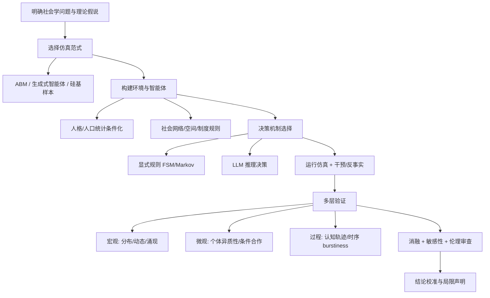

# 多智能体社会学仿真实验方法总结

> 基于参考论文库（25篇）整理，面向 Multi-Agent 社会学仿真实验设计。  
> **重要性排序规则**：使用自然数 0, 1, 2, … 编号，**数字越小，论文越重要**（对构建科学、可复现的社会学仿真实验越核心）。

---

## 一、总体方法论框架

多智能体社会学仿真实验的“科学性”通常需要同时回答四个问题：

| 维度 | 核心问题 | 代表性论文 |
|------|----------|------------|
| **效度（Validity）** | 仿真结果能否代表真实人类/社会现象？ | 2A, 1C, 4A, 3C |
| **机制（Mechanism）** | 宏观现象是否来自可解释的微观决策规则？ | 2B, 3B, 1B, 1A |
| **可证伪性（Falsifiability）** | 能否与人类数据、理论预测、消融实验对照？ | 2D, 1D, 3A |
| **伦理与对齐（Alignment & Ethics）** | 仿真是否引入偏见、操纵风险或不正当替代人类？ | 2C, Group Selection, Opinion Polarization, LLM城市信息层 |

### 1.1 实验设计通用流程（综合多篇论文）

### 1.2 跨论文共性方法清单

#### A. 人类对齐（Human Alignment）

- **算法保真度（Algorithmic Fidelity）**：条件化 LLM 后，其响应分布是否与特定人群一致（2A, 1C）。
  - 四准则：社会科学图灵测试、后向连续性、前向连续性、模式对应。
- **硅基采样（Silicon Sampling）**：用真实调查边际分布重加权 LLM 生成样本，纠正训练数据人口偏差（2A）。
- **多层验证**：宏观（合作率、极化指数）≠ 微观（个体异质性、条件策略）一致时，需分别报告（4A）。
- **过程级对齐**：BDI/E 认知状态轨迹、时序 burstiness、话语分布，而非仅终端结果（1D, 2D, Temporal Realism）。
- **社会规范显式化**：从成功/失败交互中归纳可量化规范原则，再注入 Agent（2C）。

#### B. AI 伦理

- **宏观-微观解离风险**：集体结果“像人”不代表个体机制“像人”（4A）。
- **对抗与操纵**：有限预算对手即可放大极化；缓解机制难以完全恢复基线（Opinion Polarization）。
- **信息不平等**：LLM 作为城市信息层会系统性忽视弱势社区场所（LLM城市信息层）。
- **替代人类实验的伦理边界**：LLM 仅作假设筛选/试点，不可替代因果识别所需的真实实验（1C, Rebuilding Statistics）。
- **生成式智能体伦理**：拟社会关系、深度伪造、定向说服风险需缓解（2B）。
- **对齐目标冲突**：个体奖励优化（RLHF/可验证奖励）可能削弱多智能体合作（Group Selection, OdysSim）。

#### C. 强化学习（RL）与训练

- **行为基础模型训练管线**（OdysSim）：
  1. 中期训练（Midtraining）于大规模人类交互语料；
  2. 按能力轴（SOUL: CONV/SS/COG/ROLE/EVAL）做任务特定 RL（GRPO / 语言反馈 RL）；
  3. 专家蒸馏合并为单一可部署模型。
- **奖励黑客检测**：LLM-as-Judge 作奖励时需检测与缓解 reward hacking（OdysSim）。
- **社会规范 + 蒸馏**：规范约束的 LLM 策略可蒸馏为轻量实时策略（2C）。
- **经济 ABM 中的 RL**：传统 RL-ABM 受限于定制奖励函数，难以跨场景泛化（4B SAMAS 对比）。
- **群体选择作为“进化 RL”**：在代际间选择/变异自然语言策略提示，促进合作（Group Selection）。

#### D. 消融实验（Ablation）与敏感性分析

| 消融对象 | 目的 | 代表论文 |
|----------|------|----------|
| 记忆 / 反思 / 规划模块 | 验证架构必要性 | 2B |
| 人口统计条件化字段 | 验证硅基样本有效性 | 2A, 1C |
| 模型规模 / 计算量 | 判断“堆规模”是否足够 | 3C |
| FSM vs LLM 决策器 | 检验决策机制是否改变结论 | 3A |
| 时序门控机制 | 验证 burstiness 来自机制而非 LLM 本身 | Temporal Realism |
| 提示消融 / 模型替换 | 检验结论稳健性 | Group Selection, 1A |
| 随机 Agent 混合比例 | 检验微观异质性匹配 | 4A |
| 有/无社会规范约束 | 验证规范原则的因果作用 | 2C |

#### E. 评估指标体系（科学性的“度量层”）

- **分布级**：Mann-Whitney U、KS 检验、Wasserstein 距离、Cliff's delta（2D MiroBench）
- **策略级**：Jensen-Shannon 散度（3A）
- **动态拟合**：经典意见动力学模型参数（DeGroot, FJ, HK + bias）（1A）
- **认知过程**：BDI/E 准确率、CTS 轨迹分数（1D）
- **时序**：Burstiness B、自激参数 α（Temporal Realism）
- **标度律**：compute scaling law、loss→accuracy 校准（3C）
- **博弈/合作**：合作率时间序列、条件合作规则、异质性分布（4A, Group Selection）

---

## 二、按重要性排序的论文方法详解

---

### 【0】Generative Agents: Interactive Simulacra of Human Behavior（2B）

**类别**：仿真系统 / 架构奠基  
**核心问题**：如何让 LLM Agent 在长期交互中表现出可信的人类行为与社会涌现？

**关键方法**：
- **架构三模块**：Memory Stream（观察→自然语言记忆）→ Reflection（记忆合成高层推断）→ Planning（分层计划与重规划）。
- **记忆检索**：相关性 + 新近性 + 重要性加权检索。
- **仿真环境**：25 个 Agent 的沙盒小镇（类 The Sims），支持自然语言干预。
- **评估**：
  - *控制评估*：自然语言“访谈”探测角色一致性、记忆、计划；
  - *端到端评估*：2 天开放仿真观察涌现社交（如情人节派对自发组织）。
- **消融实验**：分别移除 memory / reflection / planning，验证各组件对可信度的因果贡献。
- **伦理讨论**：拟社会关系、深度伪造、说服风险；建议日志记录与用途限制。

**对你实验的启示**：社会学仿真若关注**长期涌现**（规范、关系、集体行动），应采用“记忆-反思-规划”架构，而非单轮 prompt。

---

### 【1】Out of One, Many: Using Language Models to Simulate Human Samples（2A）

**类别**：人类对齐 / 效度验证  
**核心问题**：LLM 能否作为特定人群的“硅基代理”用于社会科学？

**关键方法**：
- **算法保真度（Algorithmic Fidelity）**：四准则框架（见上）。
- **硅基采样**：用真实 ANES 等调查的后台故事条件化 GPT-3，生成与真实样本匹配的“硅基被试”。
- **边际校正**：重加权 P(人口统计) 以匹配目标人群。
- **三项研究**：自由文本党派描述、投票预测、封闭式问卷相关结构。
- **消融**：温度变化、完全合成数据、不同模型规格对比。
- **伦理视角**：将“算法偏见”重新定义为**可条件化的多分布反射**，而非单一偏差。

**对你实验的启示**：任何“用 LLM 代替人类被试”的实验，必须先报告**与真实数据的模式对应性**，而非仅看表面相似。

---

### 【2】OdysSim: Building Foundation Models for Human Behavior Simulation

**类别**：训练方法 / 基准 / RL  
**核心问题**：通用 LLM 的“助手化”对齐如何导致 Sim2Real 行为差距？如何训练行为基础模型？

**关键方法**：
- **SOUL 五轴能力分类**：CONV（对话）、SS（社会技能）、COG（认知）、ROLE（角色扮演）、EVAL（判断）。
- **ODYSSIM 语料**：2140 万交互、62 数据源；**回溯生成社会语境**（角色档案、交互目标）补全缺失 grounding。
- **训练配方**：Midtraining → 每轴任务特定 RL（GRPO / RLVF）→ 专家蒸馏。
- **SOUL-Index**：23 任务开放基准；报告 8/23 任务第一。
- **消融**：仅 midtraining vs +RL 的定性差异；奖励黑客检测与缓解。
- **零样本迁移**：τ-USI 用户仿真反应对齐 93.2 vs 真人 93.5。

**对你实验的启示**：若需**可复现、可优化**的 Agent 行为，考虑专用行为模型 + 明确奖励轴，而非仅依赖 frontier LLM + prompt。

---

### 【3】Using LLMs to Simulate Human Behavioural Experiments: Port of Mars（1C）

**类别**：实验效度 / 集体行动困境  
**核心问题**：多 Agent LLM 能否有效模拟复杂集体风险社会困境（CRSD）？

**关键方法**：
- **实验选择**：Port of Mars——叙事驱动、不完全信息、训练数据污染风险低。
- **Agent 设计**：角色扮演（Curator/Pioneer 等）+ 多阶段 prompt（讨论、规划、交易、系统健康）。
- **效度验证**：对照算法保真度四准则；与人类实验数据直接比较。
- **扩展实验**：社会价值取向（SVO）、领导力等 persona 变异。
- **与 RL 对比**：LLM 无天然奖励信号，宜用社会身份/角色动机而非金钱激励。
- **局限声明**：算法保真度方法论意义尚未完全确立。

**对你实验的启示**：集体行动类社会学实验应优先选择**近新颖、叙事嵌入**的任务，并直接与人类实验基准对照。

---

### 【4】Will Scaling Improve Social Simulation with LLMs?（3C）

**类别**：科学方法论 / 规模律  
**核心问题**：继续扩大 LLM 规模能否自动解决社会仿真保真度问题？

**关键方法**：
- **三大推断问题**：调查仿真 P(y|x)、行为仿真 P(a_t|h_t)、纵向预测 P(y_{t+k}|y_t,x)。
- **控制规模实验**：85 个 Qwen3 模型（0.2B–12B），固定架构与预训练分布，测 compute scaling law。
- **观察性实验**：35 个开源模型至 70B，建立 loss→accuracy 校准函数。
- **微调对照**：Llama3/Qwen2.5 0.5B–8B 微调，检验“不随规模改善”的任务是否可通过微调解决。
- **关键发现**：
  - 多数意见/行为仿真随规模显著改善；
  - 纵向预测、风险厌恶等认知偏差、低资源人群仿真改善缓慢；
  - 社会仿真与通用能力（MMLU）相关性 0–0.85，并非完全正相关。

**对你实验的启示**：必须做**规模/模型敏感性分析**；不能假设“更大模型 = 更可信社会学结论”。

---

### 【5】Collective Cooperation without Individual Fidelity in LLM Agents（4A）

**类别**：验证方法论 / 人类对齐警示  
**核心问题**：LLM Agent 宏观合作动态何时能/不能作为人类代理？

**关键方法**：
- **基准**：Gracia-Lázaro 等大规模网络囚徒困境人类实验（相同拓扑与协议）。
- **九种开源 LLM** 作为自主 Agent，编排层管理多轮交互。
- **三层验证**：
  1. 宏观：合作率时间演化（早期下降、后期稳定）；
  2. 微观：个体合作倾向分布与异质性；
  3. 决策规则：条件合作（对邻居历史行为的响应）。
- **干预**：混合随机 Agent 比例，检验微观匹配改善。
- **核心发现**：**宏观-微观解离**——宏观像人，微观机制不像人。
- **对齐批判**：LLM 为“有用助手”优化，非“人类行为”优化。

**对你实验的启示**：社会学仿真**必须报告宏观+微观+机制三层指标**；仅报告涌现模式是不够的。

---

### 【6】Should LLM Agents Decide in Social Simulations?（3A）

**类别**：方法论风险 / 可解释性  
**核心问题**：用 LLM 选择社交动作是否会偏离研究者设定的行为策略？

**关键方法**：
- **对照设计**：显式 FSM/Markov 策略（按用户类型转移概率）vs LLM 动作选择器。
- **环境**：1000 Agent 合成 OSN，10000 次动作决策（读/赞/转/评/发/关注等）。
- **三模型 × 三提示策略**（base / guided / probabilistic）。
- **对齐度量**：Jensen-Shannon 散度 + Laplace 平滑。
- **成本分析**：LLM 比 Markov 采样慢数百倍。
- **结论**：LLM 不能可靠保持参考策略；额外引导可能引入系统性动作偏置。

**对你实验的启示**：**内容与决策分离**——LLM 生成帖子，动作用可解释规则；或显式报告策略偏离。

---

### 【7】MiroBench: Benchmarking Realism in Agentic Simulation of Real-world Discussions（2D）

**类别**：评估基准 / 分布真实性  
**核心问题**：仿真讨论是否在统计分布上匹配真实 Reddit 社区？

**关键方法**：
- **数据**：4292 真实 Reddit 线程，5 领域，875 种子上下文。
- **四指标族（12 核心指标）**：
  1. 重复与语义均匀性（Self-BLEU, BERTScore, 余弦相似度）；
  2. 叙事内容（StorySeeker）；
   3. 毒性与攻击性（Detoxify）；
  4. 结构（长度变异、树深度、结构病毒性）。
- **统计检验**：Mann-Whitney U、KS 检验（p 值为主统计量）；Wasserstein、Cliff's delta 为辅。
- **轻量 prompt 改进**：增益有限。
- **结论**：当前仿真器即使单条评论流畅，**分布级仍显著失配**。

**对你实验的启示**：社会学仿真评估应加入**分布级统计检验**，不能只看个案可读性。

---

### 【8】Cognitive World Models for Process-Level Social Influence Evaluation（1D）

**类别**：过程评估 / 认知建模  
**核心问题**：如何评估社会影响的“过程”而非终端文本？

**关键方法**：
- **CogWM 架构**：联合预测 BDI/E（信念、欲望、意图、情绪）+ 用户话语。
- **Summarize-and-Allocate (SaA)**：两阶段标注，150,454 用户轮次，4 类社会影响场景。
- **三层评估**：
  - 轮次级：8 自动 + 5 LLM-Judge 指标；
  - 轨迹级：4 个金融时序启发的动态指标；
  - 任务级：CTS（复合轨迹分数）、GO（良好结果）。
- **多 Agent 辨别实验**：3600 次试验区分 6 种商业 Agent 的认知影响能力。
- **对比**：优于 BLEU/ROUGE 与终端 LLM-Judge。

**对你实验的启示**：社会影响、说服、规范内化类实验应追踪**认知状态轨迹**，而非仅测最终态度。

---

### 【9】Characterizing Opinion Evolution of Networked LLMs（1A）

**类别**：意见动力学 / 机制识别  
**核心问题**：经典意见动力学模型能否解释 LLM 网络中的信念演化？

**关键方法**：
- **实验**：多 LLM 在通信图上讨论争议话题；stance 识别模型将消息转为数值意见。
- **模型拟合**：DeGroot、Friedkin-Johnsen、Hegselmann-Krause 及含 bias 的变体。
- **RQ 分解**：stubbornness / homophily / bias 的相对重要性；跨模型族与话题泛化；边权重灵活性。
- **关键发现**：**bias（内在回归意见）** 是主要驱动，加入后可降低累计误差达 88%。
- **跨模型**：Qwen、Llama、Gemma 结论可泛化。

**对你实验的启示**：网络舆论仿真可用**可解释数学模型**校准 LLM 涌现，识别与经典社会理论的对应/偏离。

---

### 【10】Learning Social Norms Enhances Compatibility in Dynamic Human–AI Coordination（2C）

**类别**：人类对齐 / 社会规范 / RL  
**核心问题**：动态人机协调中，如何超越模仿学习实现对齐？

**关键方法**：
- **任务**：行人-车辆动态博弈（3456 次人类交互，96 被试）。
- **规范归纳**：对比成功/失败交互，提炼三原则——
  1. 结果可预测性（P）；
  2. 价值对齐（V）；
  3. 优势意识（A）。
- **开环评估**：LLM 对人类轨迹重放的协调表现。
- **闭环人类实验**：规范约束 LLM 总分约为基线 4 倍，超人类-人类 43%。
- **蒸馏**：规范原则蒸馏为轻量实时策略仍有效。
- **对比 RL/IL**：纯奖励优化产生非人策略；模仿无法恢复潜在协调结构。

**对你实验的启示**：动态社会学交互（谈判、避让、轮流）需要**显式规范形式化**，而非仅靠 demonstration 对齐。

---

### 【11】Group Selection Promotes Prosocial Prompts in Populations of LLM Agents

**类别**：多智能体对齐 / 进化 / 合作  
**核心问题**：个体级对齐是否足以保证 Agent 群体合作？

**关键方法**：
- **框架**：LLM Agent 重复 donor game；策略以**自然语言 prompt** 代际传递。
- **选择机制操纵**：个体选择 vs 群体选择。
- **理论复现**：多层次复制子-突变子模型 + 经验突变核；相变阈值。
- **消融**：prompt 消融、游戏框架替换、模型替换。
- **预期行为**：GPT-5.4 在知晓选择机制时表现出预判性调整（其他模型未见）。
- **伦理含义**：当前 frontier 训练偏向个体可验证奖励，可能系统性削弱合作。

**对你实验的启示**：多 Agent 社会学实验应明确**选择层级**（个体/群体），并检验对齐目标是否抑制合作涌现。

---

### 【12】Modeling Putnam's Social Capital Theory with LLM-based Multi-agent Simulations（3B, SocaSim）

**类别**：理论驱动仿真  
**核心问题**：如何用 LLM 多 Agent 系统检验社会学理论（社会资本）？

**关键方法**：
- **理论对齐环境**：社会网络演化 + 信任动态 + 规范传播。
- **两阶段回合**：Proposal（提案）→ Execution（执行/合作决策）。
- **验证**：
  - 宏观：复现 Putnam 宏观模式；
  - 人类对齐：群体层面；
  - 反事实干预：追踪微观因果路径。
- **应用**：智慧养老适应挑战场景。
- **对比**：传统 ABM 规则过于简化；现有 LLM 仿真多为行为驱动而非理论驱动。

**对你实验的启示**：将社会学理论操作化为**可干预的多 Agent 环境变量**（信任、规范、网络密度）。

---

### 【13】S3: Social-network Simulation System with LLM-Empowered Agents（0B）

**类别**：社交网络仿真系统  
**核心问题**：如何用 LLM Agent 仿真在线社交网络中的情绪、态度与互动？

**关键方法**：
- **Agent 三态仿真**：情绪、态度、互动行为（转发/发帖/沉默）。
- **人口统计推断**：prompt engineering + prompt tuning 推断年龄、性别、职业。
- **记忆**：历史发帖内容影响当前状态。
- **场景**：性别歧视、核能政策等真实议题。
- **双层评估**：个体级 + 群体级（信息/态度/情绪传播）准确率。

**对你实验的启示**：OSN 类社会学实验可参考 S3 的**态度-情绪-行为耦合**与真实网络数据校准。

---

### 【14】Emergent Relational Order in LLM Agent Societies（1B, CAREB-MAS）

**类别**：长期社会结构涌现  
**核心问题**：LLM Agent 社会能否自发再现费孝通“差序格局”等关系秩序？

**关键方法**：
- **理论整合**：情感控制理论 + 社会认同理论 + 涂尔干集体情感。
- **Agent 推理链**：情感→伦理→信念。
- **宏观环境**：仅设定生产、偏好分配、最小交互协议（无预设等级）。
- **涌现现象**：劳动分工、关系伦理、合作衰减、关系权威、宗族中心-边缘分层。
- **长期仿真**：跨时间尺度观察结构演化。
- **生产结构干预**：亲属中心 vs 功能互依改变涌现模式。

**对你实验的启示**：文化社会学/组织社会学可设计**最小制度环境**，检验宏观结构是否涌现。

---

### 【15】EconSimulacra: Digital Twin Platform of Socio-Economic Systems

**类别**：社会经济数字孪生  
**核心问题**：如何耦合消费、移动、社交多域行为？

**关键方法**：
- **共享内部状态**：跨域经验（如饥饿、压力）汇入统一决策。
- **三域**：消费经济、社交网络、空间移动。
- **记忆机制**：多域观察→内部状态→跨域行动。
- **案例**：在线关注度与线下门店客流非线性关系复现。
- **对比**：单域仿真或并列多域无法产生跨域反馈。

**对你实验的启示**：城市/经济社会学仿真需建模**跨域状态耦合**，而非孤立子系统。

---

### 【16】Opinion Polarization in LLM-Based Social Networks: Manipulation and Mitigation

**类别**：对抗仿真 / AI 伦理  
**核心问题**：LLM 社交网络对意见操纵有多脆弱？如何缓解？

**关键方法**：
- **框架**：多样 persona Agent 在自然语言帖子中更新意见。
- **攻击**：有限预算对手放大极化。
- **防御**：
  - 反应式：指定用户主动反制；
  - 主动式：改变曝光/连接/活动模式。
- **结论**：两种防御均**无法完全恢复**无操纵基线。
- **与数学模型对比**：经典数值意见模型无法捕捉语言说服、情绪、persona 依赖响应。

**对你实验的启示**：信息传播/极化实验应包含**对抗鲁棒性**与伦理风险情景。

---

### 【17】Toward Temporal Realism in City-Scale Crisis Response Simulation using LLM Agents

**类别**：时序真实性 / 危机社会学  
**核心问题**：LLM 仿真是否复现真实人类活动的 burstiness（爆发性时序）？

**关键方法**：
- **实证**：深圳 660 万志愿服务记录，个体与群体均呈自激 burstiness。
- **基线缺陷**：纯 LLM 同步调度 ≈ Poisson，无爆发性（median B = -0.14）。
- **机制增强**：数据校准自激通道 + 危机期状态门控；**何时行动**由机制决定，**做什么**由 LLM 决定。
- **结果**：per-agent median B ≈ 0.37，且不损害内容决策质量。
- **核心原则**：时序真实性与语义真实性**解耦设计**。

**对你实验的启示**：危机动员、集体行动仿真必须验证**时间分布**（heavy-tail、聚类），不能只用回合制同步推进。

---

### 【18】Empowering Economic Simulation Through Situation-Aware LLM-Driven System（4B, SAMAS）

**类别**：经济仿真 / 情境感知  
**核心问题**：如何让经济 Agent 具备宏观危机记忆与群体同质性？

**关键方法**：
- **双层情境感知**：
  - 长期：LLM 参数中的宏观经济常识（大萧条、次贷危机等）；
  - 短期：个体轨迹记忆（近期决策、职业群体意见）。
- **职业群体**：白领/蓝领/业主等同质信息传播。
- **对比**：规则 ABM 无情境感知；RL-ABM 难跨场景泛化。
- **评估**：波动率真实性、拐点预测。

**对你实验的启示**：经济社会学 Agent 应注入**历史宏观事件感知 + 社会群体分类**。

---

### 【19】Hierarchical Generative Agents for Simulating Sequential Human Behavior

**类别**：灾害行为 / 层级认知  
**核心问题**：如何仿真灾难疏散中的序列化、非理性人类决策？

**关键方法**：
- **三层认知**：高层疏散目标 → 中层路径推理 → 低层导航。
- **Persona 条件化 LLM** + 认知模块。
- **动态环境**：火灾蔓延、有限可观测性。
- **人类数据校准**：调查数据 + PADM（保护行动决策模型）。
- **应用**：疏散策略评估、警报设计、搜救机器人测试。

**对你实验的启示**：应急/集体行为社会学需**层级规划 + persona + 动态刺激**，避免一次性理性决策假设。

---

### 【20】"Rebuilding" Statistics in the Age of AI

**类别**：元方法论 / 学科范式（非技术论文）  
**核心问题**：统计学如何应对 AI 时代的研究实践变迁？

**关键方法（讨论要点）**：
- 从狭义方法论转向**端到端系统级问题解决**；
- **数据工作**（标注、清洗、治理）作为可信 AI 基础；
- 统计学核心优势：**不确定性量化、偏差评估、因果推理、严格评估**；
- 人才培养：沟通、协作、计算、跨学科合作；
- 与 AI 利益相关方（产业、资助方、政策）建立可持续合作。

**对你实验的启示**：LLM 社会学仿真论文应主动对接**统计推断标准**——报告不确定性、偏差来源、因果边界。

---

### 【21】Large Language Models Create an Uneven Informational Layer over Cities

**类别**：AI 伦理 / 城市社会学审计  
**核心问题**：LLM 推荐如何系统性制造城市空间可见性不平等？

**关键方法**：
- **审计设计**：5 美国城市 × 304 社区 × 320 合成用户画像（收入/年龄/性别/居住状态因子设计）。
- **双假设检验**：
  - 认识论失败（数据缺失→幻觉）；
  - 分配性失败（有完整列表仍选择性忽视）。
- **指标**：幻觉率、覆盖率缺口、跨模型共享盲点（31.9%）。
- **人群分层**：高收入用户获更贵/更冷门店；游客 vs 本地居民差异。
- **经济模拟**：需求转移对独立餐厅 vs 连锁的影响。

**对你实验的启示**：若仿真涉及**信息中介/推荐系统**，需审计对不同社区与人群的系统性偏差。

---

### 【22】CoMind: Understanding Collaborative Human Activity from Multiple Minds and Views

**类别**：人类协作数据 / ToM 基准（非 LLM 仿真论文）  
**核心问题**：如何测量协作中的心智理论（Theory of Mind）？

**关键方法**：
- **多模态数据**：41 小时真实烹饪协作，第一/第三视角视频、凝视、音频、3D 场景。
- **三任务基准**：共同注意估计、社会条件动作预测、协作递物预测。
- **VLM 基准测试**：揭示当前模型社会感知不足。
- **微调验证**：在 CoMind 上微调可显著提升。

**对你实验的启示**：人机/多人协作社会学实验可借鉴其**多视角标注 + ToM 任务分级**作为人类基线。

---

### 【23】Who is a Better Player: LLM against LLM

**类别**：对抗评测平台（与社会学仿真弱相关）  
**核心问题**：如何用棋类对抗赛评估 LLM 综合能力？

**关键方法**：
- **Qi Town 平台**：五类棋局，20 个 LLM 玩家。
- **Elo 评级 + Performance Loop Graph (PLG)**：捕捉循环胜负不稳定性。
- **Positive Sentiment Score (PSS)**：情绪适应度。
- **对比 Q&A 基准**：不依赖大规模静态数据集，更灵活。

**对你实验的启示**：可用于检验 Agent **策略稳定性与压力情境表现**，但不直接替代社会学效度验证。

---

### 【24】World Craft: Agentic Framework to Create Visualizable Worlds via Text

**类别**：仿真环境构建工具  
**核心问题**：如何让非程序员用自然语言创建可执行 AITown 环境？

**关键方法**：
- **World Scaffold**：结构化游戏场景标准。
- **World Guild**：多 Agent 渐进解析用户意图 → 生成布局与资产。
- **空间纠错数据集**：反向工程减少“物理幻觉”。
- **多维度评估**：与 Cursor、Antigravity 等商业代码 Agent 对比。

**对你实验的启示**：属于**实验基础设施**；降低社会学仿真场景搭建成本，但不提供社会学验证方法本身。

---

## 三、面向你实验的“科学性检查清单”

在设计 Multi-Agent 社会学仿真实验时，建议逐项核对：

### 3.1 实验前

- [ ] 是否有明确社会学理论或人类经验基准？
- [ ] Agent 是否用人口统计/人格/角色条件化（硅基采样）？
- [ ] 决策机制是否可解释（FSM/Markov vs LLM）？是否报告策略偏离（3A）？
- [ ] 是否考虑训练数据污染（选择近新颖任务，1C）？

### 3.2 实验中

- [ ] 是否设置反事实/干预条件（网络结构、规范、选择机制）？
- [ ] 是否记录过程数据（认知轨迹、时序、话语结构）？
- [ ] 是否做多模型 / 多规模 / 多提示敏感性分析（3C）？
- [ ] 是否包含消融（架构模块、规范原则、选择层级）？

### 3.3 实验后

- [ ] **宏观**：群体指标是否与人类/理论一致？
- [ ] **微观**：个体异质性与条件策略是否验证（4A）？
- [ ] **分布**：是否通过统计检验而非目视（2D）？
- [ ] **时序**：若涉及时序行为，是否验证 burstiness（17）？
- [ ] **伦理**：是否讨论替代人类、操纵风险、偏见与不平等（16, 21, 2B）？
- [ ] **局限**：是否声明 LLM 对齐目标≠人类行为目标（4A, OdysSim）？

### 3.4 若使用强化学习

- [ ] 奖励是否与社会学构念对齐（而非仅任务成功）？
- [ ] 是否检测 reward hacking（OdysSim）？
- [ ] 是否考虑个体奖励 vs 群体选择的冲突（11）？
- [ ] 是否报告 midtraining / RL / 蒸馏各阶段消融（OdysSim）？

---

## 四、推荐方法组合（按研究目标）

| 研究目标 | 推荐论文组合 | 核心方法 |
|----------|--------------|----------|
| 替代/补充人类调查实验 | 2A + 3C + 1C | 算法保真度 + 规模律 + 行为实验对照 |
| 小镇/日常社会涌现 | 2B + 1B + 0B | 记忆-反思-规划 + 长期结构 + 网络传播 |
| 舆论/极化/信息传播 | 1A + 16 + 2D | 意见动力学拟合 + 对抗实验 + 分布检验 |
| 合作/集体行动/规范 | 1C + 4A + 11 + 3B | CRSD 基准 + 宏观微观验证 + 群体选择 + 理论环境 |
| 人机动态协调 | 2C + 1D | 规范三原则 + BDI 过程评估 |
| 训练专用行为 Agent | OdysSim + 2C | SOUL 轴 RL + 规范蒸馏 |
| 城市/危机/时序社会学 | 17 + 19 + 15 | burstiness 机制 + 层级疏散 + 跨域数字孪生 |
| 经济学与社会分层 | 4B + 21 + 15 | 情境感知 ABM + 信息层审计 + 社会经济耦合 |

---

## 五、论文文件夹结构说明

参考库按主题分为以下几类（根据文件名前缀）：

| 前缀 | 主题方向 | 篇数 |
|------|----------|------|
| A | 舆论动力学 / 合作机制 / 行为基础模型 | 5 |
| B | 仿真系统 / 平台 / 经济数字孪生 | 10 |
| C | 人类实验效度 / 规范学习 / 规模律 | 4 |
| D | 评估基准 / 认知世界模型 | 2 |
| 其他 | 城市信息伦理、统计范式、协作数据、评测平台、环境构建 | 4 |

---

## 六、总结

这 25 篇论文共同指向一个核心结论：

> **多智能体社会学仿真的科学性，不取决于 Agent 能否生成“看起来合理”的文本，而取决于能否在宏观模式、微观机制、过程轨迹、分布统计和伦理边界五个层面，被独立地证伪或支持。**

其中，**2B（Generative Agents）** 提供了架构范式，**2A（Silicon Sampling）** 提供了人类对齐标准，**OdysSim** 提供了可训练的 behavior foundation model 路径，**3C** 与 **4A** 则分别划定了“规模能解决什么”和“宏观像人不够”的方法论边界。将这五篇作为方法论主轴，再按具体研究问题从其余论文中选取评估、伦理、RL 与消融组件，可构建较为完整的社会学仿真实验体系。

---

*文档生成日期：2026-07-25*  
*论文来源：`reference/papers/` 目录下 25 篇 PDF*
